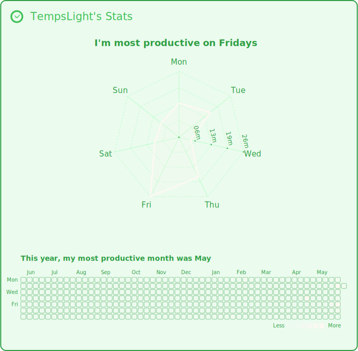

<!--
**TempsLight/TempsLight** is a ✨ special ✨ repository because its README appears on your GitHub profile.
-->

# Hi, I’m Mark Angelo

**Web & Mobile Developer**

---

## About Me

I am a **4th-year Bachelor of Science in Information Technology (BSIT) student**, majoring in **Web and Mobile Development**, currently **working as an On-the-Job Training (OJT) Intern at Aljay Agro Industrial Solutions Inc.** where I am applying my skills and gaining hands-on experience in a professional environment.

**Education**

- BSIT – Web & Mobile Development (4th Year, Ongoing)

**Areas of Expertise**

- Full-stack development using Next.js
- Database design and management with PostgreSQL and MySQL
- Modern UI development utilizing Tailwind CSS and ShadCN UI
<!--

---

## GitHub Activity

---

-->

## Tech Stack

**Languages & Frameworks**

**UI & Styling**

**Databases & ORM**

---

## Featured Project

### <a href=https://psyche-kic.vercel.app>**PSYCHE-KIC**</a>

_A Web-based Appointment and Assessment System for Youth Mental Health Support_

- Full-stack **Next.js** application
- Role-based dashboards for **psychologists, clients and admins**
- Session-based authentication
- Leaflet heatmap for appointment visualization
- Prisma ORM (NeonDb for database)
- Deployed on **Vercel**

---

## Other Projects

### **Water Station System (POS & Inventory)**

An intuitive **Point of Sale (POS)** system designed specifically for local water stations, featuring analytics, inventory control, and employee accountability.

**Key Features**

- Comprehensive inventory management for products and supplies
- Interactive statistics dashboard with real-time data visualization

**Tech Stack**

- Next.js
- SQLite
- Prisma
- ShadCN UI

**Remarks**

- Commissioned project
- Designed for **single user use and local/offline hosting**, ensuring seamless integration with existing infrastructure

---

### **File Management System**

A centralized document management platform that enables efficient organization, tracking, and retrieval of important files with location-based metadata.

**Key Features**

- Full CRUD operations with customizable document fields
- Category-based organization and file location mapping
- Streamlined document tracking and management

**Tech Stack**

- Next.js

**Remarks**

- Commissioned project
- Designed for **local hosting**
- Uses **JSON-based file storage** for lightweight data persistence

---

## Contact Me

  
  
  

---

## Let’s Connect

I’m currently seeking full-time opportunities where I can contribute, grow, and continue learning from experienced developers.
If you’re looking for a motivated and dedicated developer who enjoys building real systems—let’s connect.

<!--START_SECTION:waka-->
https://wakatime-readme-stats.vercel.app/api/wakatimeStats?username=your_wakatime_username&api_key=your_api_key&github_token=your_github_token
<!--END_SECTION:waka-->
https://wakatime-readme-stats.vercel.app/api/wakatimeStats?username=your_wakatime_username&api_key=your_api_key
&components=2
&title_prefix=_____%27s&border_width=2&border_radius=10&scale=true
&bg_color=e6ddd8&title_color=fcf9f2&text_color=997967&logo_color=fcf9f2&border_color=ab8c7b
&component1_scale_value=1.5&component1_type=weekly_avg&component1_chart_type=radar&component1_chart_color=fcf9f2
&component1_start_day=mo&component1_y_axis=true&component1_y_axis_label=true&component1_hide_legend=true&component1_hide_total=true
&component2_type=heatmap&component2_start_day=mo&component2_heatmap_color=fcf9f2

  

